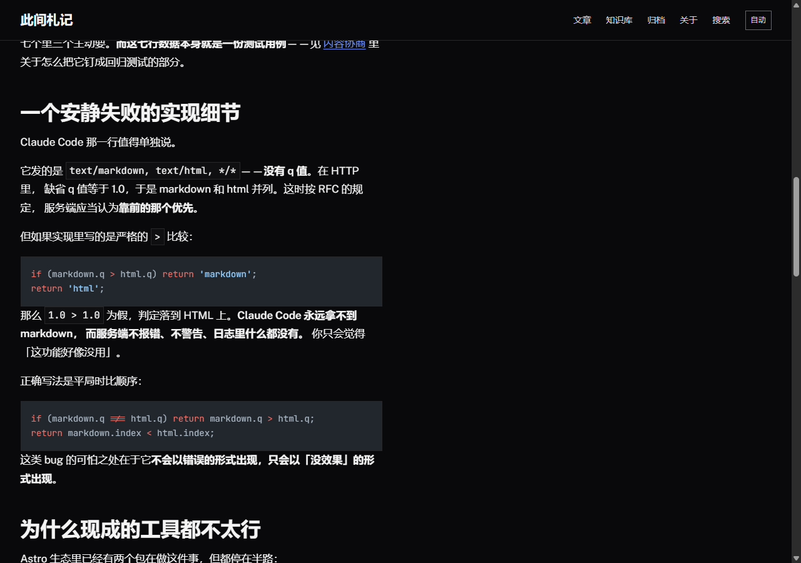

# letterpress

> **一个中文排版讲究、开箱即用的静态博客。**
> 零配置就能跑，改一个文件就能上线；文章给人读，markdown 给 AI 读。

<div align="center">

**[▶ 在线 Demo](https://xiaoxusop.github.io/letterpress/)** · **[文档](#深入)** · **[仓库](https://github.com/XIAOXUsop/letterpress)**


</div>


<details>
<summary><b>English</b></summary>

**A static blog template that gets Chinese typography right — and serves markdown to AI agents.**

- **Zero config.** `npm install && npm run dev` is the whole setup. Change a few
  lines in one file to go live. No database, no env vars.
- **Content negotiation on free static hosting.** Claude Code / Cursor / OpenCode
  send `Accept: text/markdown`; this template answers with markdown
  (RFC 7231 + RFC 7763). Edge shims for Cloudflare Pages, Netlify and Vercel are
  included — the part two existing Astro integrations explicitly skip.
  Measured saving: **64.6% / 66.5%** of tokens. → [details](docs/content-negotiation.md)
- **CJK typography, not Western defaults.** Line-height `1.75`, a `34em` measure
  (≈34 Chinese chars ≈ 68 Latin), native `text-autospace`, no synthetic italics.
  → [details](docs/cjk-typography.md)
- **A knowledge layer whose lint fails the build.** `[[wiki links]]` with
  backlinks; a broken link stops the build instead of rotting silently.
  → [details](docs/features.md)
- **0 external JS files** · 215 unit tests · 102 end-to-end contracts · MIT

Everything below is in Chinese. Live demo → <https://xiaoxusop.github.io/letterpress/>

</details>

---

## 30 秒开始

```bash
npm install
npm run dev     # → http://localhost:4321
```

**不用改配置、不用建数据库、不用填环境变量。** 你现在看到的就是完整站点。

上线只改 `src/config.ts` 里的几行：

```ts
export const site: SiteConfig = {
  title: '你的站名',
  url: 'https://example.com',      // 部署前填，不留斜杠
  lang: 'zh-CN',                   // 别改错，浏览器的中文标点规则依赖它
  author: { name: '你的名字', bio: '一句话介绍自己。' },
};
```

没配完也没关系——**关于页会列出还差哪些字段**，改完提示自动消失。

---

## 三件别人没做的事

### 一、给 AI 读的 markdown，而不是加个 `llms.txt` 交差

Claude Code、Cursor、OpenCode 请求网页时会发 `Accept: text/markdown`。
这是 HTTP 从 1.1 就有的**内容协商**，不是新发明。

**但静态博客做不到**——静态托管只吐文件，不解析请求头。这正是 Cloudflare 的
Markdown for Agents 要 Pro 及以上套餐、Vercel 的实现只在自己平台内生效的原因。
现有的两个 Astro 集成，一个**只在 dev server 里生效**，一个**完全不做协商**。

本项目补上它们跳过的那一段：**三个平台的边缘函数**，转换在构建期完成。
实测同一页面的 markdown 比 HTML 省 **64.6% / 66.5%** 的 token。

三个会**静默失败**的地方——不报错，只是永远不生效：

1. **Claude Code 不发 q 值，只靠顺序。** 缺省 q 是 1.0，两个候选并列；
   用严格的 `>` 比较会判成「无偏好」而返回 HTML。
2. **通配符 `*/*` 不等于「想要 markdown」**，它意思是「给什么都行」。
3. **`q=0` 是明确拒绝**，不是「偏好为零」。

→ [完整论证、七个 agent 的实测请求头、收益率](docs/content-negotiation.md)

### 二、中文排版按中文的规矩来


<details>
<summary>暗色模式（同一个页面）</summary>



</details>

| 参数 | 西文常用 | 本项目的取值 |
|---|---|---|
| 行高 | 1.4–1.5 | **1.75** |
| 行宽 | `66ch` | **`34em`** |
| 强调 | 斜体 | **加粗**（中文没有斜体字形） |
| 中西文间距 | 手动加 / pangu.js | **`text-autospace`**（原生） |

`34em` 是关键：一个汉字约 1em 宽、一个西文字母平均约 0.5em 宽，于是它
**同时满足**中文的 30–40 字与西文的 45–75 字符两个理想区间。按 `ch` 排中文，
每行会排出约 **130 个汉字**。

→ [取值理由、字体栈顺序、怎么验证](docs/cjk-typography.md)

### 三、知识层，断链会让构建失败

文章是**流**（按时间排，读过就沉底），知识是**网**。所以有一层独立的
`src/content/wiki/`，用 `[[方括号]]` 互链。

这是 Karpathy 在 2026 年 4 月提出的 LLM-wiki 模式，但做了一处关键改动：

> **体检是确定性的，不是「让 agent 定期看看」。**

后者不可复现、不可回归、进不了 CI。所以会腐烂的机械问题做成了代码：
**断链会使构建中止**，出口写在错误信息里，不用查文档。

---

## 实测数据

| 项 | 结果 |
|---|---|
| 单元测试 | **215 项**，全部离线，无网络依赖 |
| 端到端契约 | **102 项**，打在真实构建产物上（由脚本自己打印；含按内容页数展开的断言，条数随内容浮动） |
| 构建 | 32 页；`astro build` 自报 **约 1.1 秒**，整条 `npm run build` 约 **2.6 秒**（差值是 npm 启动开销 + Pagefind 索引 0.14 秒） |
| 外部 JS | **0 个文件**（首页仅 2.4 KB 内联） |
| CSS | 单文件 **21.7 KB / gzip 4.6 KB** |
| 字体 | **100 KB**（只含拉丁子集；中文走系统字体，零额外下载） |
| 对比度 | 亮暗双模式，所有文字实测 **≥4.5:1** |

---

## 已知限制

**如实列出，不打算假装这些不存在。**

- **Demo 部署在 GitHub Pages 上，因此跑不了内容协商**（Pages 的响应头不可改）。
  其余功能都可在线验证；内容协商需要 Cloudflare Pages / Netlify / Vercel，
  本地可用 `npm run verify` 实测——它会打印真实的 token 节省数字。
- **内容协商只对三个平台有现成实现。** GitHub Pages 不行；其他平台需自写垫片，
  共享逻辑在 `src/lib/negotiate/edge.ts`，约 40 行。
- **Vercel 的头配置（`vercel.json`）没有在 Vercel 上实际部署验证过**——
  本项目只在 GitHub Pages 上跑 Demo。选 Vercel 请自己 curl 一次确认。
- **七个 agent 里只有三个要 markdown。** Codex、Copilot、Gemini CLI、Windsurf
  目前都只接受 HTML。这个比例会变，但今天的事实就是这样。
- **分享图不含文字。** 给字体做光栅化需要 Satori + resvg 这类几十 MB 的依赖，
  本项目不引。平台会在卡片里单独显示标题，图片承担的是视觉标识。
  要带标题的分享图，在 frontmatter 里写 `cover:` 或 `ogImage:` 指向自制图片。
- **`og:image` 需要配置 `site.url`。** 分享图必须是绝对地址，没有域名时
  宁可不输出——给社交平台一个 `localhost` 地址会变成坏图，比没有更糟。
- **中文搜索没有词干处理。** Pagefind 对 zh-cn 不做词干提取（中文本来也没有
  词形变化），但**会影响召回**：实测搜「排版」7 条、「网页排版」只有 3 条。
  这是静态站搜索的固有限制，不是某个库的缺陷。
- **`llms.txt` 的实际效果被高估。** Ahrefs 实测 13.7 万个域名里 97% 从未被
  请求过。本项目生成它是因为零成本，**但不把它当卖点**。
- **`text-autospace` 与 `text-spacing-trim` 在 Safari / Firefox 上不支持**
  （后者全球覆盖约 72%）。属渐进增强，不支持时版式不坏。
- **搜索的加载器要求 CSP 允许 `unsafe-eval`**，原因见
  [命令行](docs/cli.md#搜索的加载器为什么要求-csp-允许-unsafe-eval)。
- **没有数学公式、流程图、多语言、图片灯箱、评论。** 见[竞品对照](docs/compare.md)。

---

## 深入

| | |
|---|---|
| [竞品对照](docs/compare.md) | vs AstroPaper / Fuwari / PaperMod，以及本项目缺什么 |
| [功能清单](docs/features.md) | 完整功能表、没有做的、为什么删掉「定时发布」 |
| [内容协商](docs/content-negotiation.md) | 原理、七个 agent、会静默失败的三个地方、收益率 |
| [中文排版取值](docs/cjk-typography.md) | 行高 / 字重 / 行宽 / 原生属性 / 字体栈 |
| [部署](docs/deploy.md) | 四个平台、子路径、`Vary: Accept`、安全头 |
| [命令行](docs/cli.md) | 每个脚本做什么、两个会咬人的地方 |
| [设计取舍](docs/design-notes.md) | 为什么不用 Tailwind、为什么配色避开米色衬线 |
| [AGENTS.md](AGENTS.md) | 给 AI agent 读的项目约定（知识层怎么写、检查怎么加） |

---

## License

[MIT](LICENSE) © 2026 XIAOXUsop

字体：[Archivo](https://github.com/Omnibus-Type/Archivo)、
[Public Sans](https://github.com/uswds/public-sans)、
[JetBrains Mono](https://github.com/JetBrains/JetBrainsMono)，均为 SIL OFL 1.1。
